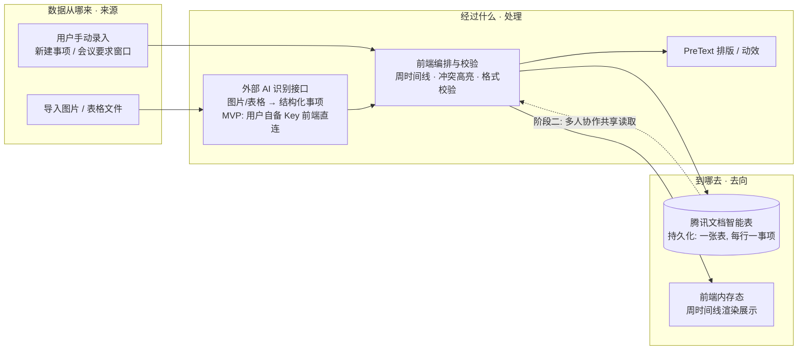

# TECH_DESIGN.md — WorkShop 技术设计

> 文档类型：技术设计文档 v0.1
> 日期：2026-09-20（Day 5 产出）
> 依据：PRD.md（Day 4）、research.md（Day 3）
> 状态：MVP 技术路线确认稿（仅设计，不含代码）

---

## 0. 一句话数据流（Day 5 要掌握的）

数据从「**用户手动录入** ＋ **图片/表格经外部 AI 识别**」**来**，在前端编排后「存入**腾讯文档一张表**（持久化）＋ 在**周时间线**渲染展示」**去**。

---

## 1. 前后端与数据库分工

### 1.1 三个角色是什么（概念速记）

- **前端（Frontend）**：运行在用户浏览器里的部分。用户能看到、能点的页面都归它——周时间线、新建/导入按钮、会议要求表单、右侧详情栏。它负责"把数据画出来"和"把用户操作收上来"。
- **后端（Backend）**：跑在服务器上的逻辑。典型职责是：存数据、算业务规则、对接别的系统。它用户看不到，是"幕后"。
- **数据库（Database）**：专门存数据的地方。可以是传统数据库（MySQL/Postgres），也可以是云文档、本地文件等任何"数据最终落地的载体"。

### 1.2 本产品的边界结论

| 角色 | WorkShop（MVP）怎么落 | 说明 |
|---|---|---|
| 前端 | 纯浏览器单页应用（HTML + CSS + JS） | 承担**几乎所有**编排与渲染：周时间线、表单、详情、导入预览、冲突高亮雏形 |
| 后端 | **无自建后端** | 不做服务器逻辑；只"调接口"——由前端直接向外部服务发请求 |
| 数据库 | **腾讯文档在线表**（一张表，每行一个事项） | 数据最终落地在腾讯文档，而非自建数据库 |

> 补充：前端渲染层引入 **PreText 排版引擎**做零 DOM 测量的真实字形排版与动态效果（见 §2）。这是"怎么画得好看/动得自然"的手段，不改变上面的角色划分。（PreText 依 **Day 7 决策暂缓至后续**：MVP 用默认渲染、前端 `timeline.js` 预留 `renderItemText()` 接缝，后续合并不重写；见 §2.4）

### 1.3 为什么这样分（MVP 阶段）

1. **MVP 是单端轻量 Web**：PRD 明确"单端 Web、桌面优先"，不需要账号体系、不需要多端同步，因此没有自建后端/数据库的早期理由。
2. **"数据库"直接用腾讯文档**：PRD §2/§5 已定"事项字段存入腾讯文档"。腾讯文档本身是成熟的在线表，多人协作、分享、API 都现成——把它当数据库，省掉一整套存储架构。
3. **外部能力走"调接口"而非"自己造"**：图片/表格识别调用外部免费 AI 接口；腾讯文档读写调用其开放 API。前端直接发起这些请求即可，无需在中间再架一层自己的服务器。
4. **代价与边界**：无自建后端意味着暂不做服务端校验、不做私密数据托管；识别接口与腾讯文档 API 都依赖外部服务的可用性与授权。这些留到阶段二（Node/Python 后端部署）再补强，不在 MVP 范围。

### 1.4 一句话小结

> MVP：**前端**把一切编排画出来，**腾讯文档**当数据库，**外部 AI 接口 + 腾讯文档 API** 当仅有的"后端动作"——没有自己的服务器。

### 1.5 必须提前说的一个安全前提（检索发现）

外部 AI 识别接口（OCR）需要 **API Key**。公开资料明确警告：**密钥绝不能写进前端页面/安装包**，否则可被反编译提取、产生异常账单。这给"纯前端无后端"带来一个真实约束：

- **MVP 做法**：识别接口由**用户自行在应用设置里填入自己的 OCR Key**，仅存浏览器 `localStorage`，不硬编码、不进代码仓库、不上传。前端用该 Key 直连 OCR。这样仍是"无自建后端"，且密钥安全（属于用户自己）。
- **阶段二做法**：改用 Node/Python 后端做**密钥代理**——Key 放服务端环境变量，前端只调自己的后端，后端再转发 OCR。多用户/共享场景更省心。

> 腾讯文档 API 同理需 `access_token`（来自开放平台自建应用的 Client ID/Secret），MVP 也可由用户本地持有，阶段二统一由后端托管。

---

## 2. 技术路线生成（含理由）

### 2.1 技术路线一行总结

> 前端用**纯静态 Web + PreText 排版层**把周时间线画出来并做动态效果；数据落地走**腾讯文档智能表 API**；图片/表格识别走**百度智能云 OCR**（MVP 用户自备 Key 前端直连，阶段二 Node/Python 代理）；无自建完整后端，Node/Python 后端列入阶段二。

### 2.2 分层选型表

| 层 | 技术 | 职责 | 为什么选它（理由） |
|---|---|---|---|
| 页面/框架 | 纯静态 Web：HTML + CSS + 原生 JS（单页，桌面优先） | 周时间线、表单、详情、导入预览的载体 | MVP 单端轻量，无需框架与构建链；最快出可见原型；后续可平滑接框架 |
| 排版/动效 | **PreText**（@chenglou/pretext v0.0.9） | 零 DOM 测量的真实字形排版 + 动态效果（色块文字、时间轴标注） | 用户自有引擎；免除 `getBoundingClientRect`/`offsetHeight` 触发 reflow；支持中文（Intl.Segmenter）、Canvas/SVG 渲染 |
| 数据存储（=数据库） | **腾讯文档 智能表（Smartsheet）API** | 事项字段持久化（一张表，每行一个事项） | PRD 已定"数据存腾讯文档"；开放 API v2 支持记录增删改查（如 `add_records`），验证可行；复用腾讯生态、天然多人协作（阶段二） |
| 图片/表格识别（外部 AI） | **百度智能云 OCR**（通用文字识别 + 表格文字识别 V2） | 把上传的图片/表格转成结构化事项字段 | 2026 免费额度对个人友好（通用 1000 次/月、表格 V2 500 次/月）；中文 OCR 成熟、文档完整；备选腾讯云 OCR（同生态，1000 次/月） |
| 密钥托管（MVP） | 用户自备 OCR/腾讯文档 Key，存 `localStorage` | 前端直连外部接口而不硬编码密钥 | 满足"无自建后端"且密钥不泄露（见 §1.5） |
| 后端（阶段二） | **Node.js / Python** 轻量服务 | 密钥代理、服务端校验、腾讯文档机器人 MCP 协作 | MVP 验证价值后再投入；多用户/共享场景统一托管密钥与权限 |

### 2.3 选型依据（来自今日网页检索，非凭记忆）

- **外部 AI 识别接口**：检索确认百度/腾讯/阿里 OCR 均有个人免费额度；百度中文 OCR 文档最完整、免费量最大，定为 MVP 首选；腾讯云 OCR 因同生态列为备选。检索同时确认**密钥绝不能进前端代码**（见 §1.5），故 MVP 走"用户自备 Key"方案。
- **腾讯文档写入可行**：检索确认腾讯文档开放 API v2 的「在线智能表」支持记录增删改查（如 `add_records`），数据落腾讯文档在技术上可行；需后续在开放平台建应用拿 token（人工步骤，不在今天）。
- **PreText 现状**：检索确认最新为 **v0.0.9（2026-09-07）**，纯 JS/TS、DOM-free、支持中文与 Canvas/SVG 渲染，与本产品排版/动效需求匹配。

### 2.4 今天暂不选、留阶段二的

- 自建 Node/Python 后端 + 关系数据库（MySQL/Postgres）：MVP 阶段不划算，列为阶段二（你已确认）。
- 腾讯会议真实对接、AI 会议纪要：依 PRD §6 暂缓。
- 完整移动端适配、账号体系：依 PRD §6 后续。
- PreText 排版 / 动效层：依 **Day 7 决策暂缓至后续**——MVP 用默认渲染，前端预留 `renderItemText()` 接缝，后续合并 PreText 不重写；上下周切换的滚动动效亦列为后续（见 PRD §6 暂缓表）。

---

## 3. 数据流图（一句话：数据从哪来 → 经过什么 → 到哪去）

### 3.1 图

### 3.2 用一句话说清

> 数据从**用户手动录入**和**图片/表格经外部 AI 识别**来，在**前端**编排校验（PreText 排版动效）后，存入**腾讯文档一张表**持久化、并渲染到**周时间线**展示；阶段二经同一张腾讯文档实现多人协作共享。

### 3.3 各节点对应技术（对照 §2）

| 数据流节点 | 对应技术 | 出处 |
|---|---|---|
| 来源：手动录入 / 导入 | 纯静态 Web 表单 + 文件上传 | §2.2 页面/框架 |
| 处理：AI 识别 | 百度智能云 OCR（用户自备 Key） | §2.2 图片/表格识别 |
| 处理：编排校验 | 前端 JS（周时间线、冲突高亮、校验） | §2.2 页面/框架 |
| 处理：排版动效 | PreText v0.0.9 | §2.2 排版/动效 |
| 去向：持久化 | 腾讯文档智能表 API（= 数据库） | §2.2 数据存储 |
| 去向：展示 | 前端内存态 + 周时间线渲染 | §2.2 页面/框架 |

---

## 4. 余力加练（Day 5 选做）

### 4.1 方案变化时，哪些文件会受影响

> 用途：当你以后想"改个方案"（换接口、提前上后端、提前做协作/移动端），拿这张表对照——一眼看出要动哪些文件、动的是"改/增/删"、代价多大。当前仓库里真实存在的文件：PRD.md、research.md、TECH_DESIGN.md、index.html。

| 方案变化场景 | 受影响文件 / 模块 | 影响性质 | 风险 / 代价 |
|---|---|---|---|
| 识别接口从百度 OCR 换腾讯云 / 智谱 / 本地模型 | 识别适配层（新模块，封装 OCR 调用） TECH_DESIGN.md §2.2 / §2.3、密钥配置说明 | 改 + 增 | 低：只要把 OCR 调用封装成一个适配层，换供应商只改这一处 |
| 阶段二 Node/Python 后端提前做（密钥代理、服务端校验） | TECH_DESIGN.md §1 / §2、新增 `server/` 目录、PRD §6 范围前移 | 改 + 增 | 中：引入部署、运维、环境变量管理，需本地起服务 |
| 多人协作 / 颜色标签区分提前做 | PRD §6、腾讯文档表结构（加"归属标签/颜色"字段）、前端渲染层 | 改 + 增 | 中：表结构一变，写入/读取都要加字段；协作冲突策略要定 |
| 移动端适配提前做 | 前端布局 CSS（桌面优先改响应式）、PreText 响应式参数、PRD §6 | 改 | 中：桌面优先的代码要补断点；触摸交互要重做 |
| 存储从腾讯文档换成自建数据库 | 数据层（新写 DB 访问）、TECH_DESIGN.md §2、放弃腾讯文档天然协作 | 改 + 删（部分） | 高：放弃现成协作/分享；要自己管存储、迁移旧数据 |
| PreText 升级或弃用 | 排版 / 动效层、TECH_DESIGN.md §2.2 | 改 | 低：排版封装在一层，替换影响面小 |
| 腾讯文档 API 政策 / 额度变动 | 数据持久化层、备选存储评估 | 改 | 中：依赖外部服务的常见风险，需有降级预案 |

**结论**：本产品真正"怕改"的是**存储选型**（腾讯文档 ↔ 自建 DB）和**协作/移动端提前**——它们会牵动表结构与多处前端代码；**识别接口**和 **PreText** 因为已被建议封装成独立适配层，改动代价最低。

### 4.2 技术栈科普：做网页 / App 会用到哪些技术

> 一句话：技术栈 = 把"想法"变成"能用的产品"所需的那一整套工具与语言。下面按"搭一个产品要哪些层"逐项说清用途与优劣势。

**① 前端（用户在屏幕上看到、能点的部分）**
- **HTML**：页面的"骨架/结构"（标题、按钮、输入框在哪）。无优劣势可言，是地基。
- **CSS**："皮肤/样式"（颜色、排版、间距）。优势：纯声明式、好调；劣势：复杂布局与响应式断点易乱。
- **JavaScript（JS）**："大脑/交互"（点按钮发生什么、数据怎么动）。优势：浏览器原生支持、生态最大；劣势：弱类型、易出隐蔽 bug（故衍生 TypeScript 加类型）。
- **框架（React / Vue 等）**：把页面拆成"组件"复用、自动管理数据变化。优势：中大型项目开发快、好维护；劣势：要学概念、包体更大、MVP 原型反而重——所以本 MVP 先不用。

**② 构建 / 工程化（把代码打包成能上线的样子）**
- **Vite / Webpack**：压缩、打包、热更新。优势：开发体验好、产物小；劣势：配置有学习成本。本 MVP 纯静态可暂不引入。

**③ 后端（用户看不到的"幕后"）**
- **Node.js**：用 JS 写后端，前后同语言。优势：上手快、适合 I/O 密集；劣势：CPU 重计算弱。
- **Python**：生态丰富（AI/脚本强）。优势：写起来快、库多；劣势：运行性能一般、部署稍繁。
- **Go**：高性能。优势：并发强、单文件部署；劣势：表达相对啰嗦。
- 本产品 MVP **无后端**，阶段二才用 Node/Python 做密钥代理。

**④ 数据库（数据最终落地处）**
- **关系型（MySQL / Postgres）**：表格化、强一致。优势：严谨、通用；劣势：要自己架、要运维。
- **NoSQL（MongoDB 等）**：灵活文档结构。优势：schema 自由；劣势：一致性需自己把握。
- **云文档（腾讯文档智能表）**：本 MVP 的"数据库"。优势：零运维、天然协作/分享、有 API；劣势：不是为高频事务设计、受外部额度与政策约束。

**⑤ 外部服务 / API（借别人的能力）**
- **OCR / AI 识别接口、云存储、云函数**等。优势：不自己造轮子、快；劣势：要 Key、有额度/费用、依赖可用性（见 §1.5 密钥安全）。

**本产品技术栈小结**：MVP = 前端（HTML/CSS/JS + PreText）+ 云文档当库 + 外部 AI 识别；阶段二才补后端与自建 DB。选轻不选重，先用最少的工具验证"周时间线"价值。

